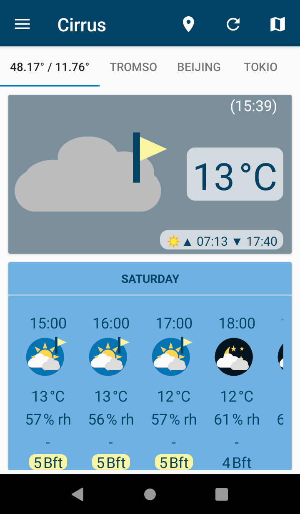
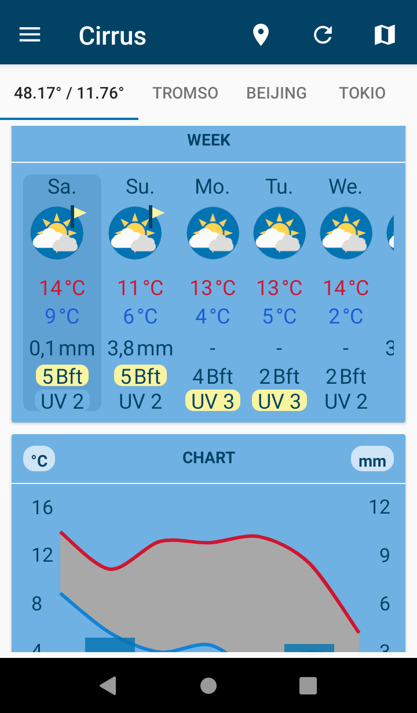
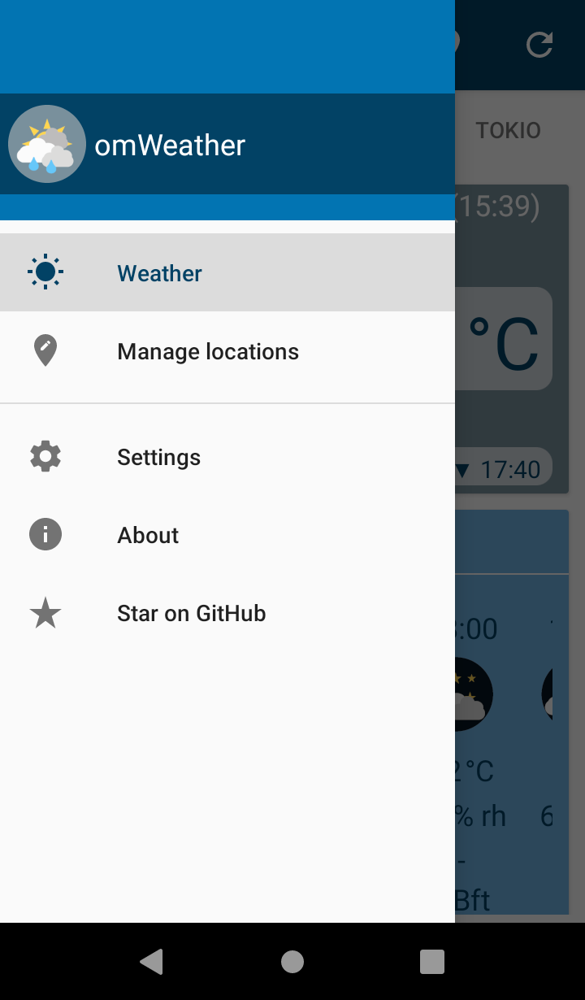
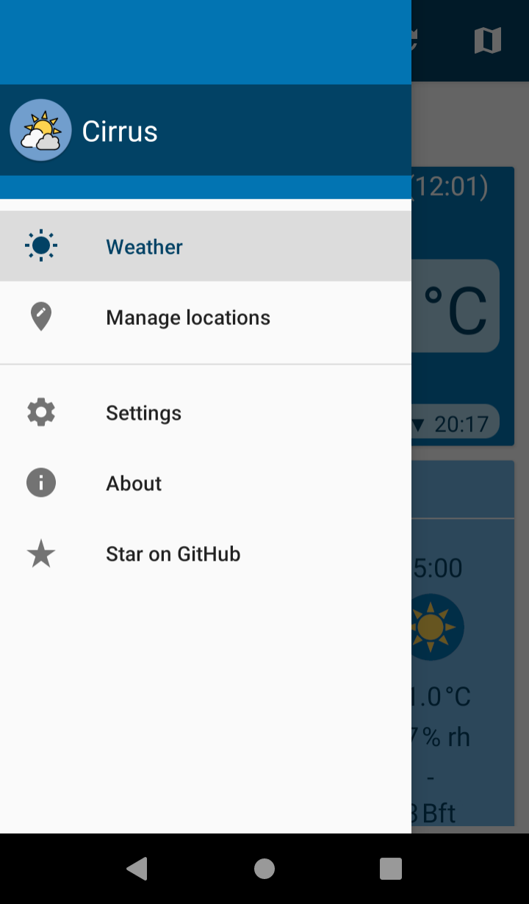
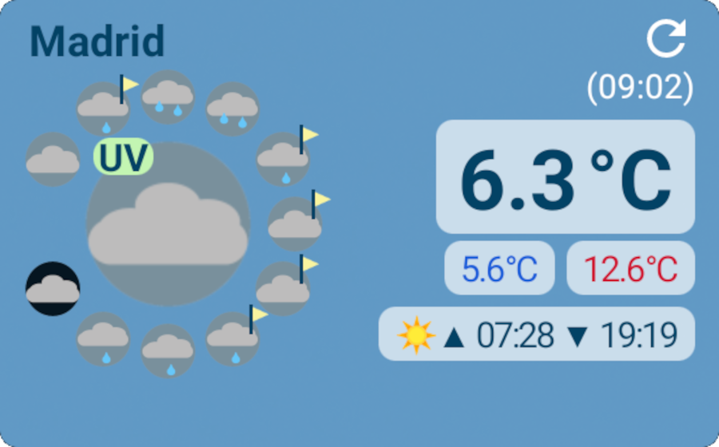
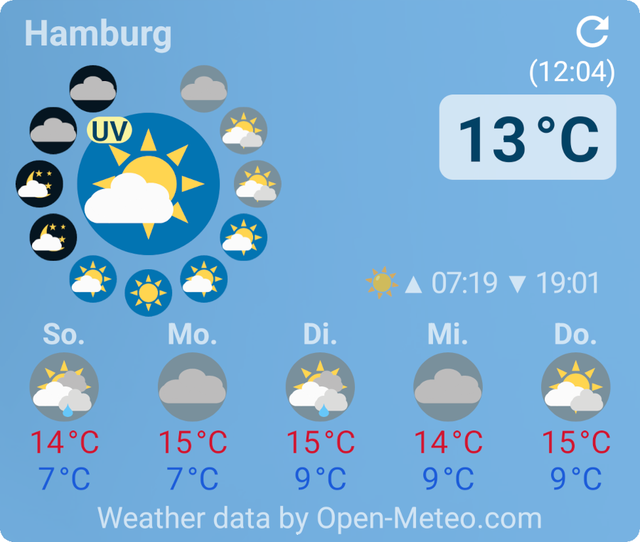
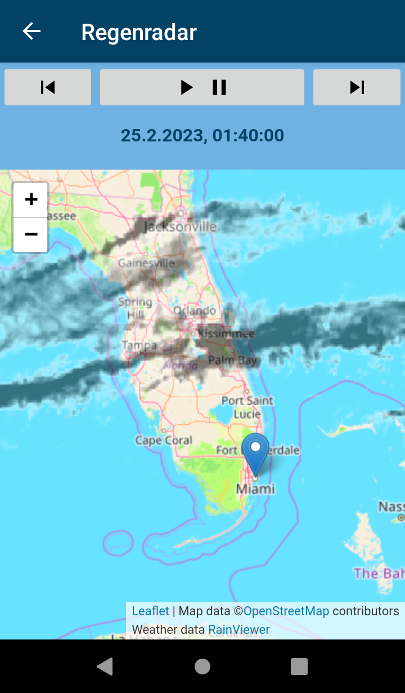
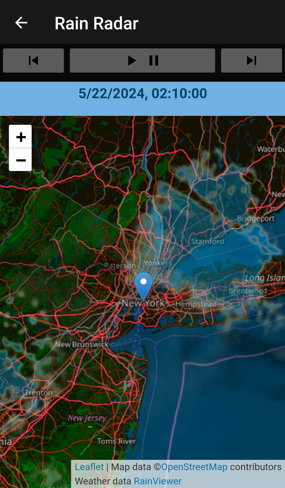
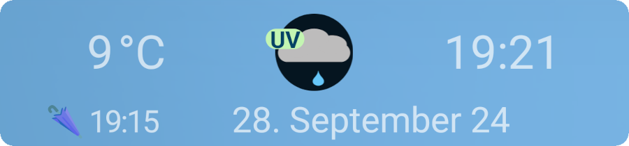
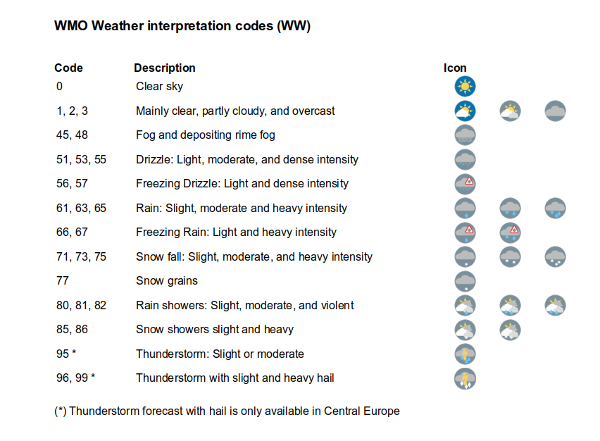

<pre>Send a coffee to 
woheller69@t-online.de 

  
Or via this link (with fees)
</pre>

| **RadarWeather** | **Gas Prices** | **Smart Eggtimer** |
|:---:|:---:|:---:|
| |  |  |
| **Bubble** | **hEARtest** | **GPS Cockpit** |
|  |  |  |
| **Audio Analyzer** | **LavSeeker** | **TimeLapseCam** |
|  | |  |
| **Arity** | **Cirrus** | **solXpect** |
|  |  |  |
| **gptAssist** | **dumpSeeker** | **huggingAssist** |
|  |  |  |
| **FREE Browser** | **whoBIRD** | **PeakOrama** |
|  |  |  |
| **Whisper** | **Seamless** | |
|  |  | |

# Cirrus

Weather and rain radar for any location - worldwide

    

    

This application is derived from Privacy Friendly Weather (https://github.com/SecUSo/privacy-friendly-weather).

The original function has been modified to support the new open source API from Open-Meteo.com with free access for non-commercial use.
In addition a rain radar functionality powered by RainViewer API (https://www.rainviewer.com/api.html) is available.

If permission for GPS is given the widget will automatically update position on a regular base.

## License

This app - like the original app Privacy Friendly Weather - is licensed under the GPLv3, © woheller69.

The app also uses:
- The weather data service is provided by [Open-Meteo](https://open-meteo.com/), under <a href='http://creativecommons.org/licenses/by/4.0/'>Attribution 4.0 International (CC BY 4.0)</a>
- RainViewer API which is free (https://www.rainviewer.com/api.html)
- Icons from [Google Material Design Icons](https://material.io/resources/icons/) licensed under <a href='http://www.apache.org/licenses/LICENSE-2.0'>Apache License Version 2.0</a>
- Material Components for Android (https://github.com/material-components/material-components-android) which is licensed under <a href='https://github.com/material-components/material-components-android/blob/master/LICENSE'>Apache License Version 2.0</a>
- Leaflet which is licensed under the very permissive <a href='https://github.com/Leaflet/Leaflet/blob/master/FAQ.md'>2-clause BSD License</a>
- WilliamChart (com.db.chart) (https://github.com/diogobernardino/williamchart) which is licensed under <a href='http://www.apache.org/licenses/LICENSE-2.0'>Apache License Version 2.0</a>
- Android Volley (com.android.volley) (https://github.com/google/volley) which is licensed under <a href='https://github.com/google/volley/blob/master/LICENSE'>Apache License Version 2.0</a>
- AndroidX libraries (https://github.com/androidx/androidx) which is licensed under <a href='https://github.com/androidx/androidx/blob/androidx-main/LICENSE.txt'>Apache License Version 2.0</a>
- AutoSuggestTextViewAPICall (https://github.com/Truiton/AutoSuggestTextViewAPICall) which is licensed under <a href='https://github.com/Truiton/AutoSuggestTextViewAPICall/blob/master/LICENSE'>Apache License Version 2.0</a>
- Map data from OpenStreetMap, licensed under the Open Data Commons Open Database License (ODbL) by the OpenStreetMap Foundation (OSMF) (https://www.openstreetmap.org/copyright)
- Osmdroid (https://github.com/osmdroid/osmdroid) licensed under <a href='http://www.apache.org/licenses/LICENSE-2.0'>Apache License Version 2.0</a>
- 
## Contributing

If you find a bug, please open an issue in the Github repository, assuming one does not already exist.
  - Clearly describe the issue including steps to reproduce when it is a bug. In some cases screenshots can be supportive.
  - Make sure you mention the Android version and the device you have used when you encountered the issue.
  - Make your description as precise as possible.

If you know the solution to a bug please report it in the corresponding issue and if possible modify the code and create a pull request.

